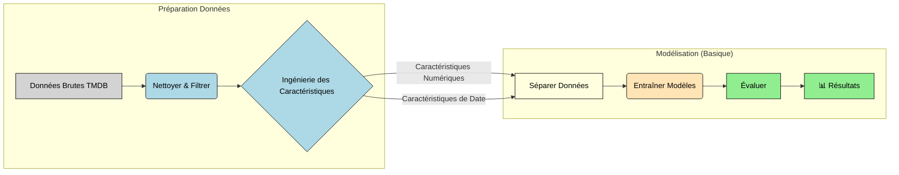

<div align="center">

# 🎬 y_BoxOffice 🎥

_Prédiction des Revenus au Box-Office avec Machine Learning (En cours)_

[]() []() []()

</div>

----------

## 📊 Aperçu du Projet

> _"Les chiffres entrent, les prédictions sortent. Peut-être."_

Un projet de machine learning visant à prédire les revenus au box-office des films en se basant sur les métadonnées disponibles. Actuellement, nous explorons des modèles de base avec un ensemble limité de caractéristiques.

----------

## 🎯 Objectif

L'industrie cinématographique est un jeu à enjeux élevés. Les studios et les investisseurs cherchent à réduire les risques de leurs investissements en prédisant les revenus potentiels. Ce projet explore la faisabilité de construire un tel modèle prédictif en utilisant des données publiquement disponibles. Le but est de comprendre quels facteurs (métadonnées, budget, notes, timing, etc.) sont corrélés au succès financier.

----------

## 💾 Données & Source

*   **Source :** Les données proviennent de kaggle dataset [Full TMDB Movies Dataset 2024 ( 1M Movies)](https://www.kaggle.com/datasets/asaniczka/tmdb-movies-dataset-2023-930k-movies) plus précisément du fichier `TMDB_movie_dataset_v11.csv`.
*   **Contenu :** Il s'agit principalement de métadonnées de films, incluant :
    *   **Identifiants :** Titre, date de sortie.
    *   **Quantitatif :** `runtime` (durée), `vote_average` (note moyenne), `vote_count` (nombre de votes), `revenue` (revenus), `budget`.
    *   **Catégoriel :** `genres`, `production_companies` (sociétés de production), `production_countries` (pays de production), `spoken_languages` (langues parlées), `original_language` (langue originale).
*   **Traitement :** L'analyse exploratoire initiale (EDA) a impliqué un nettoyage et un filtrage significatifs :
    *   Suppression des colonnes jugées non pertinentes (IDs, chemins d'images, descriptions textuelles non encore utilisées).
    *   Filtrage des films avec des dates invalides, des informations de production manquantes, des revenus extrêmement bas (< 1000$) ou des durées irréalistes (conservées entre 30 et 280 minutes).
    *   Cela a réduit le jeu de données de plus de 1,2 million d'entrées à environ 15 000 films pertinents pour la modélisation.
*   **Cible :** L'objectif principal est de prédire `revenue`. En raison de sa distribution très asymétrique, nous travaillons principalement avec `log_revenue` (transformée via `log1p`) comme variable cible dans les modèles.

----------

## 🛠️ Approche Actuelle & Méthodes



1.  **Charger & Nettoyer (`EDA_Films.ipynb`) :** Importer le CSV brut. Appliquer les filtres (durée, revenus minimums, dates, données critiques manquantes). Supprimer les colonnes inutilisées.
2.  **Ingénierie des Caractéristiques (`EDA_Films.ipynb`) :** Créer la cible `log_revenue`. Extraire `release_year` (année) et `release_month` (mois) de `release_date`. Extraction basique de la liste des genres pour les graphiques EDA.
3.  **Préparer pour la Modélisation (`Modele_Prediction_Revenus.ipynb`) :** Sélectionner les caractéristiques initiales (`runtime`, `vote_average`, `vote_count`, `release_year`, `release_month`). Séparer les données en ensembles d'entraînement (80%) et de test (20%).
4.  **Entraîner & Évaluer (`Modele_Prediction_Revenus.ipynb`) :** Entraîner des modèles de référence sur les caractéristiques numériques sélectionnées. Évaluer en utilisant RMSE, MAE et R² sur l'ensemble de test pour prédire `log_revenue`.

## 🤖 Modèles ML Utilisés (Pour l'instant)

Nous avons commencé avec deux modèles de régression courants :

1.  **Régression Linéaire (Linear Regression) :**
    *   **Pourquoi :** C'est la référence la plus simple. Utile pour vérifier les relations linéaires et rapide à entraîner. Les coefficients sont interprétables (bien que moins directement avec `log_revenue`).
    *   **Statut :** Implémentée comme benchmark. La performance est actuellement limitée (voir `Modele_Prediction_Revenus.md` pour le score R²).
2.  **Forêt Aléatoire (Random Forest Regressor) :**
    *   **Pourquoi :** Une méthode d'ensemble généralement plus puissante que la simple régression linéaire. Peut capturer des relations non linéaires et des interactions entre caractéristiques sans nécessiter de définition explicite. Moins sensible à la mise à l'échelle des caractéristiques (scaling).
    *   **Statut :** Implémentée avec des hyperparamètres de base (`n_estimators=100`, `max_depth=15`, etc.). Montre une performance significativement meilleure que la Régression Linéaire sur l'ensemble actuel de caractéristiques, indiquant des non-linéarités ou une importance des caractéristiques que le RF capture mieux.

**Note :** Il s'agit d'une étape de modélisation *préliminaire* utilisant seulement une poignée de caractéristiques numériques/dates facilement disponibles. Les prochaines étapes impliqueront l'intégration de données catégorielles (genres, sociétés de production, etc.) et potentiellement de caractéristiques textuelles, ce qui devrait améliorer la performance des modèles.

----------

## 🚀 Comment Utiliser

```bash
# Cloner le dépôt
git clone https://github.com/Beg1nner4ever/y_BoxOffice.git
cd y_BoxOffice

# Installer les dépendances
pip install -r requirements.txt

# Lancer les notebooks (EDA d'abord, puis modélisation)
jupyter notebook EDA_Films.ipynb
jupyter notebook Modele_Prediction_Revenus.ipynb

```

----------

## 📦 Stack Technique

```
python >= 3.8
pandas | sklearn | matplotlib
numpy | seaborn | jupyter

```

<div align="center">

----------

_Projet Albert School Global Data 2024-2025_

</div>