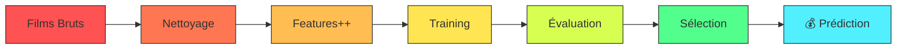

<div align="center">

# 🎬 y_BoxOffice 🎥

_Prédiction des Revenus au Box-Office avec Machine Learning_


[](https://github.com/Beg1nner4ever/y_BoxOffice) [](https://github.com/Beg1nner4ever/y_BoxOffice) [](https://github.com/Beg1nner4ever/y_BoxOffice)

</div>

----------

## 📊 Projet en bref

> _"Les données prédisent, l'argent suit."_

Un modèle ML qui analyse les facteurs de succès commercial des films - du genre aux acteurs et au timing de sortie.

----------

## 🔮 Pourquoi?

Le cinéma = business de milliards d'euros. Studios et investisseurs ont besoin de prédictions fiables avant de risquer leur argent sur des blockbusters potentiels. Notre modèle offre cette visibilité.

----------

## 🗃️ Données Analysées

```yaml
films: 13,000+
caractéristiques:
  - métadonnées: [titre, durée, date_sortie]
  - contenu: [genre, synopsis, popularité]
  - business: [studios, revenus]
  - audience: [votes, évaluations]

```

----------

## ⚡ Notre approche



1.  **🧹 Nettoyer** - Fini les données farfelues et films expérimentaux de 10 jours
2.  **🔧 Extraire** - Features temporelles, textuelles et commerciales
3.  **🧠 Entraîner** - Multiple modèles ML en compétition
4.  **📊 Évaluer** - Trouver le champion des prédictions

----------

## 🚀 Comment l'utiliser

```bash
# On clone
git clone https://github.com/yourusername/y_BoxOffice.git

# On installe
pip install -r requirements.txt

# On analyse 
jupyter notebook

```

----------

## 📦 Tech stack

```
python 3.8+
pandas | sklearn | matplotlib 
numpy | seaborn | nltk/spacy

```

<div align="center">

----------

_Projet Albert Global Data School 2024-2025_

</div>